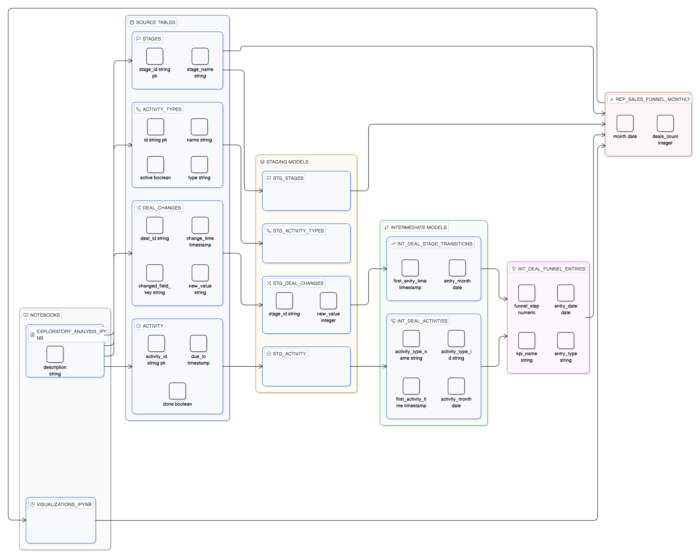

# Data Pipeline Architecture

## Overview

This document describes the layered architecture of the Pipedrive CRM sales funnel analytics pipeline, following dbt best practices with staging, intermediate, and marts layers.

## Architecture Diagram

### Visual Architecture Diagram



*Complete data flow from source tables through staging, intermediate, and marts layers to final reporting and visualizations. This diagram shows the complete data lineage from PostgreSQL source tables to the final reporting models and visualization notebooks.*

## Layer Architecture Details

### Source Layer (PostgreSQL - public schema)

**Purpose**: Raw data from Pipedrive CRM system

| Table              | Description                               | Key Columns                                        | Record Count |
| ------------------ | ----------------------------------------- | -------------------------------------------------- | ------------ |
| `stages`         | Sales funnel stages lookup                | stage_id, stage_name                               | 9            |
| `activity_types` | Activity type metadata                    | id, name, type, active                             | 4            |
| `deal_changes`   | Historical deal state changes (event log) | deal_id, change_time, changed_field_key, new_value | 30K+         |
| `activity`       | Deal activities (calls, meetings)         | activity_id, deal_id, type, due_to, done           | 9K+          |

**Characteristics**:

- Event-sourcing pattern in `deal_changes`
- Raw data types (VARCHAR where INTEGER needed)
- No data quality guarantees
- Source of truth for all funnel metrics

---

### Staging Layer (dbt - pipedrive_analytics schema)

**Purpose**: Clean, standardize, and type-cast source data

| Model                  | Source         | Key Transformations                                                                    | Materialization |
| ---------------------- | -------------- | -------------------------------------------------------------------------------------- | --------------- |
| `stg_stages`         | stages         | Direct select, column standardization                                                  | View            |
| `stg_activity_types` | activity_types | Direct select, rename columns                                                          | View            |
| `stg_deal_changes`   | deal_changes   | Cast `new_value::integer` as `stage_id`, filter `changed_field_key = 'stage_id'` | View            |
| `stg_activity`       | activity       | Direct select, column standardization                                                  | View            |

**Key Transformations**:

- Type casting: `new_value::integer` for stage_id
- Filtering: Only stage transitions (`changed_field_key = 'stage_id'`)
- Column renaming: Standard naming conventions
- Data type standardization

---

### Intermediate Layer (dbt - pipedrive_analytics schema)

**Purpose**: Apply business logic and combine data sources

| Model                          | Dependencies                                    | Key Logic                                                      | Materialization |
| ------------------------------ | ----------------------------------------------- | -------------------------------------------------------------- | --------------- |
| `int_deal_stage_transitions` | stg_deal_changes                                | MIN(change_time) per deal_id + stage_id to get first entry     | View            |
| `int_deal_activities`        | stg_activity, stg_activity_types                | MIN(due_to) per deal_id + activity_type_id, filter types 1 & 2 | View            |
| `int_deal_funnel_entries`    | int_deal_stage_transitions, int_deal_activities | UNION ALL to combine stages (1-9) and activities (2.1, 3.1)    | View            |

**Key Business Logic**:

- **First Entry Identification**: MIN() aggregation prevents double-counting
- **Funnel Step Mapping**:
  - Stages: Integer IDs (1-9)
  - Activities: Decimal IDs (2.1, 3.1)
- **Temporal Aggregation**: DATE_TRUNC('month', timestamp) for monthly grouping
- **Data Combination**: UNION ALL merges stage entries with activity entries

---

### Marts Layer (dbt - pipedrive_analytics schema)

**Purpose**: Final reporting models for business consumption

| Model                        | Dependencies                        | Output Structure                          | Materialization |
| ---------------------------- | ----------------------------------- | ----------------------------------------- | --------------- |
| `rep_sales_funnel_monthly` | int_deal_funnel_entries, stg_stages | month, kpi_name, funnel_step, deals_count | Table           |

**Output Columns**:

- `month`: DATE_TRUNC('month', entry_date)
- `kpi_name`: Stage name or activity name (COALESCE)
- `funnel_step`: Numeric step identifier (1, 2, 2.1, 3, 3.1, ..., 9)
- `deals_count`: COUNT(DISTINCT deal_id)

**Aggregation Logic**:

- Monthly grouping by `entry_date`
- Distinct deal counting per funnel step
- Ordered by month DESC, funnel_step ASC

---

## Notebooks Layer

### Exploratory Analysis Notebook

- **Queries**: Source tables directly
- **Purpose**: Data profiling, quality assessment, pattern discovery
- **Output**: Insights and recommendations for dbt modeling

### Visualizations Notebook

- **Queries**: Marts layer (`rep_sales_funnel_monthly`)
- **Purpose**: Business intelligence dashboards
- **Output**: 8 comprehensive visualizations

---

## Data Transformation Flow

### Stage Transitions Flow

```
deal_changes (event log)
  ↓ [Filter: changed_field_key = 'stage_id']
  ↓ [Cast: new_value::integer]
stg_deal_changes
  ↓ [MIN(change_time) GROUP BY deal_id, stage_id]
int_deal_stage_transitions
  ↓ [Map stage_id to funnel_step]
int_deal_funnel_entries (stage entries)
```

### Activities Flow

```
activity
  ↓ [Join with activity_types]
stg_activity
  ↓ [Filter: activity_type_id IN (1, 2)]
  ↓ [MIN(due_to) GROUP BY deal_id, activity_type_id]
int_deal_activities
  ↓ [Map to funnel_step: 2.1, 3.1]
int_deal_funnel_entries (activity entries)
```

### Final Aggregation Flow

```
int_deal_funnel_entries
  ↓ [UNION ALL: stages + activities]
  ↓ [LEFT JOIN stg_stages for kpi_name]
  ↓ [GROUP BY month, kpi_name, funnel_step]
  ↓ [COUNT(DISTINCT deal_id)]
rep_sales_funnel_monthly
```

---

## Funnel Step Mapping

| Funnel Step | Type     | Source                     | KPI Name                   |
| ----------- | -------- | -------------------------- | -------------------------- |
| 1           | Stage    | int_deal_stage_transitions | Lead Generation            |
| 2           | Stage    | int_deal_stage_transitions | Qualified Lead             |
| 2.1         | Activity | int_deal_activities        | Sales Call 1               |
| 3           | Stage    | int_deal_stage_transitions | Needs Assessment           |
| 3.1         | Activity | int_deal_activities        | Sales Call 2               |
| 4           | Stage    | int_deal_stage_transitions | Proposal/Quote Preparation |
| 5           | Stage    | int_deal_stage_transitions | Negotiation                |
| 6           | Stage    | int_deal_stage_transitions | Closing                    |
| 7           | Stage    | int_deal_stage_transitions | Implementation/Onboarding  |
| 8           | Stage    | int_deal_stage_transitions | Follow-up/Customer Success |
| 9           | Stage    | int_deal_stage_transitions | Renewal/Expansion          |

---

## Key Design Decisions

### 1. Event-Sourcing Pattern Recognition

- Identified that `deal_changes` follows event-sourcing
- Requires MIN() aggregation to identify first entry
- Prevents double-counting in funnel metrics

### 2. Type Casting in Staging

- Cast `new_value::integer` early in pipeline
- Ensures type safety for joins
- Centralized in staging layer

### 3. First Entry Logic

- Use MIN() aggregation per deal per stage
- Applied consistently across stages and activities
- Critical for accurate funnel metrics

### 4. UNION ALL for Combination

- Combines stage entries with activity entries
- Maintains funnel step ordering (decimal IDs for activities)
- Single source of truth for all funnel entries

### 5. Materialization Strategy

- Staging & Intermediate: Views (lightweight, always fresh)
- Marts: Table (performance for reporting)
- Can be changed to incremental for large datasets

---

## Performance Considerations

### Current Scale

- Source tables: ~30K-9K records (manageable)
- Supports full table scans
- View materialization sufficient

### Scalability Recommendations

- **Incremental Materialization**: For `rep_sales_funnel_monthly` if >1M records/month
- **Partitioning**: By `month` if using incremental models
- **Indexing**: On join keys (`deal_id`, `stage_id`) and filters (`changed_field_key`)

---

## Data Quality & Testing

### dbt Tests Implemented

- **Sources**: `not_null`, `unique` on primary keys
- **Staging**: Type validation, referential integrity
- **Intermediate**: Uniqueness tests on first entry views
- **Marts**: Data freshness, completeness

### Data Quality Score

- **Completeness**: ~98%
- **Consistency**: High (validated stage IDs, activity types)
- **Validity**: Good (some conversion rate anomalies require business validation)

---

## Usage Examples

### Query Final Report

```sql
SELECT 
    month,
    kpi_name,
    funnel_step,
    deals_count
FROM public_pipedrive_analytics.rep_sales_funnel_monthly
WHERE month >= '2024-01-01'
ORDER BY month DESC, funnel_step ASC;
```

### Query Stage Transitions

```sql
SELECT 
    deal_id,
    stage_id,
    first_entry_time,
    entry_month
FROM public_pipedrive_analytics.int_deal_stage_transitions
WHERE entry_month = '2024-12-01';
```

---

## Architecture Benefits

1. **Separation of Concerns**: Each layer has distinct responsibility
2. **Reusability**: Intermediate models can be used by multiple marts
3. **Maintainability**: Changes isolated to specific layers
4. **Testability**: Each layer can be tested independently
5. **Performance**: Views for freshness, tables for speed
6. **Scalability**: Easy to migrate to incremental materialization

---

## Future Enhancements

1. **Incremental Models**: For large-scale data growth
2. **Snapshots**: For historical tracking of stage changes
3. **Metrics**: dbt metrics for conversion rates, velocity
4. **Exposures**: For BI tool integration
5. **Documentation**: Enhanced dbt docs with lineage graphs
