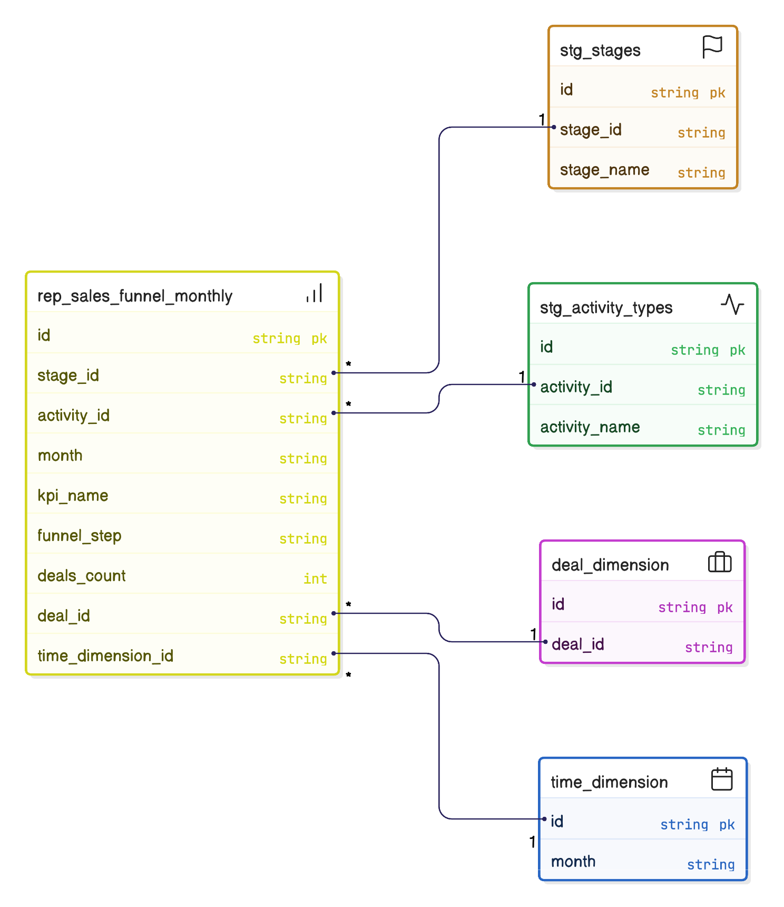
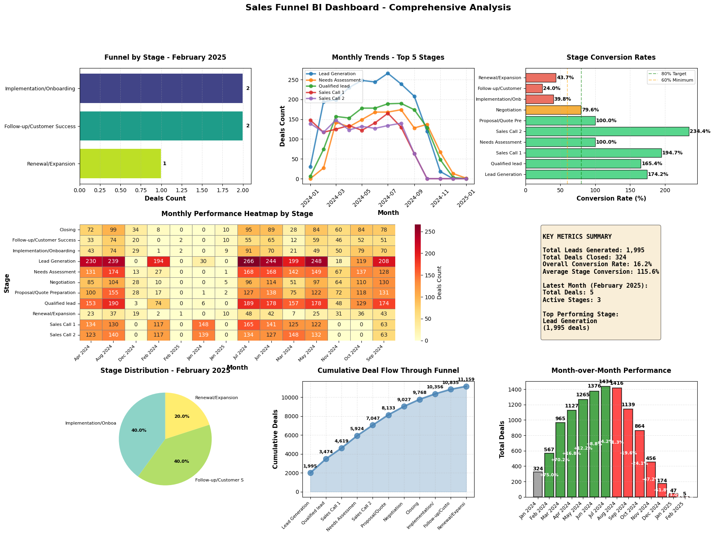

# Pipedrive CRM Sales Funnel Analytics - dbt Project

A comprehensive dbt project for analyzing Pipedrive CRM sales funnel data, implementing a layered architecture with staging, intermediate, and marts models to support monthly funnel reporting and business intelligence.

## Table of Contents

- [Setup](#setup)
- [Project Overview](#project-overview)
- [Business Objectives &amp; Star Schema Methodology](#business-objectives--star-schema-methodology)
- [Architecture](#architecture)
- [Analysis &amp; Notebooks](#analysis--notebooks)
- [Data Pipeline](#data-pipeline)
- [Reporting Model](#reporting-model)
- [Data Quality &amp; Testing](#data-quality--testing)
- [Macros](#macros)
- [Future Enhancements](#future-enhancements)
- [Project Structure](#project-structure)
- [Documentation](#documentation)

---

## Setup

1. **Download Docker Desktop** (if you don't have installed) using the official website, install and launch.
2. **Fork this Github project** to your Github account. Clone the forked repo to your device.
3. **Start PostgreSQL database**: Open your Command Prompt or Terminal, navigate to that folder, and run:

   ```bash
   docker compose up
   ```
4. **Database credentials**:

   ```
   Host: localhost
   User: admin
   Password: admin
   Port: 5432
   ```
5. **Connect to the database** via a preferred tool (e.g. DataGrip, Dbeaver, etc.)
6. **Install dbt**: Install dbt-core and dbt-postgres using pip:

   ```bash
   pip install dbt-core dbt-postgres
   ```
7. **Run dbt models**:

   ```bash
   dbt run
   ```

   Check `public_pipedrive_analytics` schema to see the dbt results.

---

## Project Overview

This project implements a sales funnel analytics pipeline for Pipedrive CRM data, following dbt best practices with a layered architecture. The pipeline transforms raw CRM data into actionable business intelligence through:

- **Staging Layer**: Clean and standardize source data
- **Intermediate Layer**: Apply business logic and combine data sources
- **Marts Layer**: Final reporting models for business consumption
- **Notebooks**: Exploratory analysis and BI visualizations

### Key Deliverables

1. Removed test model after verification
2. Deep dive into Pipedrive CRM source data structure
3. Defined dbt sources with comprehensive documentation
4. Built layered architecture (staging → intermediate → marts)
5. Created reporting model `rep_sales_funnel_monthly` with 11 funnel steps
6. Implemented exploratory analysis notebooks
7. Created BI dashboard visualizations

---

## Business Objectives & Star Schema Methodology

### Business Objectives

This project addresses critical sales analytics needs by achieving the following business objectives:

#### 1. **Sales Funnel Performance Monitoring**
   - **Objective**: Track how many deals enter each stage of the sales funnel on a monthly basis
   - **Business Value**: Identify bottlenecks, optimize conversion rates, and forecast pipeline health
   - **Achievement**: Monthly aggregated metrics showing deals_count per funnel step per month

#### 2. **Conversion Rate Analysis**
   - **Objective**: Measure conversion rates between funnel stages to identify drop-off points
   - **Business Value**: Focus sales efforts on stages with highest conversion potential
   - **Achievement**: Enables calculation of stage-by-stage conversion rates from aggregated data

#### 3. **Historical Trend Analysis**
   - **Objective**: Understand how sales funnel performance changes over time
   - **Business Value**: Identify seasonal patterns, measure impact of sales initiatives, and track growth
   - **Achievement**: Time-series data aggregated by month enables trend analysis and forecasting

#### 4. **Sales Activity Tracking**
   - **Objective**: Monitor key sales activities (Sales Call 1, Sales Call 2) as part of funnel progression
   - **Business Value**: Ensure sales reps are following the defined sales process
   - **Achievement**: Activity milestones integrated into funnel steps (2.1, 3.1)

#### 5. **Data-Driven Decision Making**
   - **Objective**: Provide accurate, reliable data for sales leadership decision-making
   - **Business Value**: Reduce guesswork, enable evidence-based sales strategy adjustments
   - **Achievement**: Clean, tested, documented data pipeline with comprehensive reporting model

### Star Schema Methodology Implementation

This project follows **Star Schema** principles, a dimensional modeling approach that organizes data into fact tables and dimension tables for optimal query performance and business user understanding.

#### Current Star Schema Design

**Fact Table**: `rep_sales_funnel_monthly`
- **Type**: Aggregated fact table (monthly grain)
- **Grain**: One row per month, per funnel step, per KPI
- **Measures**: `deals_count` (count of distinct deals)
- **Dimensions**: `month`, `kpi_name`, `funnel_step`

**Dimension Tables** (Implicit/Referenced):
- **Time Dimension**: `month` (derived from `entry_date` via DATE_TRUNC)
- **Funnel Step Dimension**: `funnel_step` + `kpi_name` (combines stage and activity dimensions)
- **Stage Dimension**: `stg_stages` (lookup table for stage_id → stage_name)
- **Activity Type Dimension**: `stg_activity_types` (lookup table for activity types)

#### Star Schema Benefits Achieved

1. **Query Performance**
   - Pre-aggregated fact table reduces query complexity
   - Simple GROUP BY operations on fact table
   - Fast filtering and aggregation on dimensional attributes

2. **Business User Understanding**
   - Intuitive structure: measures (deals_count) and dimensions (month, funnel_step, kpi_name)
   - Easy to understand: "How many deals entered each funnel step per month?"
   - Self-documenting: column names clearly indicate business meaning

3. **Scalability**
   - Fact table can be partitioned by `month` for large-scale data
   - Dimensions are normalized and reusable
   - Incremental loading strategy supports growing data volumes

4. **Flexibility**
   - Easy to add new dimensions (e.g., sales rep, product, region)
   - Can create additional fact tables for different business processes
   - Supports drill-down and roll-up operations

#### Star Schema Structure Visualization



#### How Star Schema Principles Are Applied

**1. Fact Table Design** (`rep_sales_funnel_monthly`)
- **Grain Definition**: One row per month per funnel step per KPI
- **Measures**: `deals_count` (additive measure - can be summed across dimensions)
- **Foreign Keys**: Implicit references to dimension tables via `funnel_step` and `kpi_name`
- **Aggregation Level**: Pre-aggregated to monthly level for performance

**2. Dimension Tables** (Staging Layer)
- **Stage Dimension** (`stg_stages`): Lookup table for stage_id → stage_name
- **Activity Dimension** (`stg_activity_types`): Lookup table for activity types
- **Time Dimension**: Derived dimension using DATE_TRUNC('month', entry_date)
- **Normalized Structure**: Dimensions are normalized (no redundancy)

**3. Dimensional Modeling Best Practices**
- **Surrogate Keys**: Using `funnel_step` as numeric surrogate key for ordering
- **Slowly Changing Dimensions**: Dimensions are Type 1 (overwrite) - appropriate for lookup tables
- **Conformed Dimensions**: Dimensions can be reused across multiple fact tables
- **Degenerate Dimensions**: `deal_id` is tracked in intermediate layer for drill-down capability

#### Extending to Full Star Schema

The current design can be extended to a more complete star schema by adding:

**Additional Dimension Tables**:
- **Sales Rep Dimension**: `dim_sales_rep` (user_id, name, email, team)
- **Product Dimension**: `dim_product` (product_id, product_name, category)
- **Customer Dimension**: `dim_customer` (customer_id, company_name, industry, region)
- **Time Dimension**: `dim_date` (date_key, year, quarter, month, week, day_of_week)

**Additional Fact Tables**:
- **Deal Fact Table**: `fct_deals` (deal_id, stage_id, sales_rep_id, customer_id, product_id, amount, created_date)
- **Activity Fact Table**: `fct_activities` (activity_id, deal_id, activity_type_id, sales_rep_id, date, duration)

**Benefits of Extension**:
- Enable multi-dimensional analysis (by rep, by product, by region)
- Support drill-down from aggregated to detailed level
- Create comprehensive data warehouse for broader analytics needs

#### Current Design vs. Full Star Schema

| Aspect | Current Design | Full Star Schema |
|--------|---------------|------------------|
| **Fact Table** | Aggregated monthly funnel | + Deal-level fact table |
| **Dimensions** | Implicit (stages, activities) | Explicit (dim_date, dim_sales_rep, etc.) |
| **Grain** | Monthly aggregated | + Transactional grain |
| **Use Case** | Funnel reporting | + Multi-dimensional analysis |
| **Complexity** | Simple, focused | Comprehensive warehouse |

**Current Design Rationale**: For the assessment scope, the aggregated fact table approach provides:
- Simplicity and clarity
- Fast query performance
- Meets all stated business objectives
- Easy to understand and maintain
- Can be extended to full star schema as needed

---

## Architecture

### Data Pipeline Architecture


*Complete data flow from PostgreSQL source tables through staging, intermediate, and marts layers to final reporting and visualization notebooks.*

### Layer Structure

#### 1. **Source Layer** (PostgreSQL - `public` schema)

Raw data from Pipedrive CRM system:

| Table              | Description                               | Key Columns                                                        | Record Count |
| ------------------ | ----------------------------------------- | ------------------------------------------------------------------ | ------------ |
| `stages`         | Sales funnel stages lookup                | `stage_id`, `stage_name`                                       | 9            |
| `activity_types` | Activity type metadata                    | `id`, `name`, `type`, `active`                             | 4            |
| `deal_changes`   | Historical deal state changes (event log) | `deal_id`, `change_time`, `changed_field_key`, `new_value` | 30K+         |
| `activity`       | Deal activities (calls, meetings)         | `activity_id`, `deal_id`, `type`, `due_to`, `done`       | 9K+          |

**Note on Data Source**: Currently, the data is loaded from CSV files into PostgreSQL. This is why we're using **views** for materialization in staging and intermediate layers. Once we have a true production source (API, streaming, etc.) and as data volume grows, we'll migrate **staging layer** to **incremental materialization** (intermediate will remain as views, marts will be incremental) for better performance, scalability, and cost efficiency.

#### 2. **Staging Layer** (dbt - `pipedrive_analytics` schema)

**Purpose**: Clean, standardize, and type-cast source data

| Model                  | Source             | Key Transformations                                                                    | Materialization |
| ---------------------- | ------------------ | -------------------------------------------------------------------------------------- | --------------- |
| `stg_stages`         | `stages`         | Direct select, column standardization                                                  | View            |
| `stg_activity_types` | `activity_types` | Direct select, rename columns                                                          | View            |
| `stg_deal_changes`   | `deal_changes`   | Cast `new_value::integer` as `stage_id`, filter `changed_field_key = 'stage_id'` | View            |
| `stg_activity`       | `activity`       | Direct select, column standardization                                                  | View            |

**Key Transformations**:

- Type casting: `new_value::integer` for stage_id
- Filtering: Only stage transitions (`changed_field_key = 'stage_id'`)
- Column renaming: Standard naming conventions

#### 3. **Intermediate Layer** (dbt - `pipedrive_analytics` schema)

**Purpose**: Apply business logic and combine data sources

| Model                          | Dependencies                                            | Key Logic                                                      | Materialization |
| ------------------------------ | ------------------------------------------------------- | -------------------------------------------------------------- | --------------- |
| `int_deal_stage_transitions` | `stg_deal_changes`                                    | MIN(change_time) per deal_id + stage_id to get first entry     | View            |
| `int_deal_activities`        | `stg_activity`, `stg_activity_types`                | MIN(due_to) per deal_id + activity_type_id, filter types 1 & 2 | View            |
| `int_deal_funnel_entries`    | `int_deal_stage_transitions`, `int_deal_activities` | UNION ALL to combine stages (1-9) and activities (2.1, 3.1)    | View            |

**Key Business Logic**:

- **First Entry Identification**: MIN() aggregation prevents double-counting
- **Funnel Step Mapping**:
  - Stages: Integer IDs (1-9)
  - Activities: Decimal IDs (2.1, 3.1)
- **Temporal Aggregation**: DATE_TRUNC('month', timestamp) for monthly grouping

#### 4. **Marts Layer** (dbt - `pipedrive_analytics` schema)

**Purpose**: Final reporting models for business consumption

| Model                        | Dependencies                                | Output Structure                                          | Materialization |
| ---------------------------- | ------------------------------------------- | --------------------------------------------------------- | --------------- |
| `rep_sales_funnel_monthly` | `int_deal_funnel_entries`, `stg_stages` | `month`, `kpi_name`, `funnel_step`, `deals_count` | Table           |

**Output Columns**:

- `month`: DATE_TRUNC('month', entry_date)
- `kpi_name`: Stage name or activity name (COALESCE)
- `funnel_step`: Numeric step identifier (1, 2, 2.1, 3, 3.1, ..., 9)
- `deals_count`: COUNT(DISTINCT deal_id)

### Funnel Step Mapping

| Step | Type     | Source Model                   | KPI Name                   |
| ---- | -------- | ------------------------------ | -------------------------- |
| 1    | Stage    | `int_deal_stage_transitions` | Lead Generation            |
| 2    | Stage    | `int_deal_stage_transitions` | Qualified Lead             |
| 2.1  | Activity | `int_deal_activities`        | Sales Call 1               |
| 3    | Stage    | `int_deal_stage_transitions` | Needs Assessment           |
| 3.1  | Activity | `int_deal_activities`        | Sales Call 2               |
| 4    | Stage    | `int_deal_stage_transitions` | Proposal/Quote Preparation |
| 5    | Stage    | `int_deal_stage_transitions` | Negotiation                |
| 6    | Stage    | `int_deal_stage_transitions` | Closing                    |
| 7    | Stage    | `int_deal_stage_transitions` | Implementation/Onboarding  |
| 8    | Stage    | `int_deal_stage_transitions` | Follow-up/Customer Success |
| 9    | Stage    | `int_deal_stage_transitions` | Renewal/Expansion          |

---

## Analysis & Notebooks

### Why Notebooks in a dbt Project?

While it's **not standard practice** to include notebooks in a dbt project, I've added them **on an ad-hoc basis** for the following reasons:

1. **Demonstrate Analytical Approach**: Show the exploratory data analysis process that informed the dbt model design
2. **Provide Additional Insights**: Offer deeper context and visualizations beyond what dbt models provide
3. **Support Discussion**: Enable walkthrough of the analysis during meetings and reviews
4. **Documentation**: Serve as living documentation of the data understanding process

**Note**: In a production environment, notebooks would typically be kept separate or in a dedicated analytics repository. They're included here to demonstrate the complete analytical workflow.

### Notebook Overview

#### 1. [`exploratory_analysis.ipynb`](analysis/exploratory_analysis.ipynb)

**Purpose**: Comprehensive exploratory data analysis (EDA) of Pipedrive CRM source data

**What it does**:

- **Data Profiling**: Examines database schema, table structures, and record counts
- **Data Quality Assessment**: Validates completeness, consistency, and referential integrity
- **Pattern Discovery**: Identifies data patterns, relationships, and anomalies
- **Business Logic Validation**: Maps technical implementation to business requirements
- **dbt Modeling Preparation**: Documents findings to inform dbt model design

**Key Sections**:

1. Methodology & Approach - Systematic analysis framework
2. Data Overview - Database schema exploration
3. Stages Analysis - Sales funnel stage structure validation
4. Activity Types - Activity type identification and mapping
5. Deal Changes Analysis - Event-sourcing pattern analysis
6. Activities Analysis - Sales call activities and relationships
7. Data Relationships - Referential integrity validation
8. Data Quality Checks - Completeness and consistency assessment
9. Monthly Funnel Distribution - Preview of aggregated data
10. Key Insights & Analysis Summary - Comprehensive findings

**Why this notebook**: This notebook was essential for understanding the data structure before building dbt models. It helped identify:

- Event-sourcing pattern in `deal_changes` table
- Need for MIN() aggregation to prevent double-counting
- Type casting requirements (VARCHAR → INTEGER)
- Funnel step mapping logic

#### 2. [`visualizations.ipynb`](analysis/visualizations.ipynb) / `sales_funnel_dashboard.ipynb`

**Purpose**: Business intelligence dashboard with comprehensive sales funnel visualizations

**What it does**:

- Queries the final dbt reporting model (`rep_sales_funnel_monthly`)
- Generates 8 integrated visualizations in a single dashboard
- Calculates key performance metrics and conversion rates
- Provides actionable insights for sales teams

**BI Dashboard Components**:



*Comprehensive BI dashboard showing sales funnel performance, trends, conversion rates, and key metrics.*

The dashboard includes:

1. **Funnel Chart - Latest Month** (Top Left): Horizontal bar chart showing deals count at each funnel stage for the most recent month, sorted by funnel step with color-coded bars and value annotations
2. **Monthly Trends - Top 5 Stages** (Top Center): Multi-line time series chart displaying the top 5 performing stages over time, with markers and trend lines to identify patterns and growth trajectories
3. **Stage Conversion Rates** (Top Right): Horizontal bar chart with color-coded conversion rates (green ≥80%, orange ≥60%, red <60%), including target lines at 80% and 60% thresholds, showing stage-by-stage conversion percentages
4. **Monthly Performance Heatmap** (Middle Left-Center): Two-column spanning heatmap showing deals count across all stages and months, color-coded for quick identification of high/low performing periods, with annotations showing exact values
5. **Key Metrics Summary** (Middle Right): Text panel displaying critical KPIs including:

   - Total Leads Generated: 1,995
   - Total Deals Closed: 324
   - Overall Conversion Rate: 16.2%
   - Average Stage Conversion: 115.6%
   - Latest month statistics
   - Top performing stage
6. **Stage Distribution - Latest Month** (Bottom Left): Pie chart showing percentage distribution of deals across stages for the latest month, with labels and percentage annotations
7. **Cumulative Deal Flow Through Funnel** (Bottom Center): Line chart with filled area showing cumulative deal progression from first stage to last, with annotations at each stage showing cumulative totals
8. **Month-over-Month Performance** (Bottom Right): Bar chart comparing total deals across months with color coding (green for growth, red for decline, gray for first month), including percentage change annotations on each bar

**Why this notebook**: This notebook demonstrates how the dbt models are consumed for business intelligence. It:

- Shows the end-to-end value of the data pipeline
- Provides visual insights that complement the dbt models
- Demonstrates integration between dbt and BI tools
- Serves as a reference for dashboard development

**Recommended Rename**: Consider renaming to `sales_funnel_dashboard.ipynb` or `bi_dashboard.ipynb` for better clarity.

### Why Python Notebook Instead of Power BI?

While Power BI is an excellent enterprise BI tool, I chose to create the dashboard in a Python notebook for this assessment project for the following reasons:

#### 1. **Assessment Context & Portability**

- **Self-contained demonstration**: A Python notebook can be easily shared, reviewed, and executed without requiring Power BI Desktop installation or licensing
- **Version control friendly**: Notebooks are text-based and can be tracked in Git, making it easier to review changes and demonstrate the analytical process
- **Reproducibility**: Anyone with Python can run the notebook and reproduce the exact same visualizations

#### 2. **Technical Flexibility & Customization**

- **Custom visualizations**: Python (matplotlib/seaborn) allows for highly customized visualizations tailored to specific analytical needs
- **Advanced analytics**: Easy integration with statistical libraries (numpy, scipy) for advanced calculations and transformations
- **Code transparency**: The entire analytical process is visible and auditable, showing exactly how metrics are calculated

#### 3. **Development Speed & Iteration**

- **Rapid prototyping**: Faster to iterate on visualizations and calculations during the assessment phase
- **No GUI dependencies**: Pure code-based approach allows for precise control over every aspect of the dashboard
- **Easy debugging**: Can inspect intermediate dataframes and debug calculations step-by-step

#### 4. **Integration with dbt Workflow**

- **Direct database connection**: Connects directly to PostgreSQL where dbt models are materialized
- **Seamless data consumption**: Can easily query dbt models and combine with additional transformations
- **Documentation**: Serves as executable documentation showing how dbt outputs are consumed

#### When Power BI Would Be More Appropriate

Power BI would be the better choice in a production environment when:

- **Enterprise deployment**: Need for scheduled refreshes, automated distribution, and enterprise security
- **Non-technical users**: Business users need self-service analytics without coding knowledge
- **Large-scale adoption**: Multiple teams need interactive dashboards with drill-down capabilities
- **Integration requirements**: Need to connect to multiple data sources, APIs, and cloud services
- **Collaboration features**: Require sharing, commenting, and collaborative dashboard development
- **Mobile access**: Need mobile-friendly dashboards accessible via Power BI service

#### Future Production Considerations

For production deployment, the recommended approach would be:

1. **dbt models** remain the single source of truth (as they are now)
2. **Power BI** connects to dbt materialized tables/views
3. **Python notebooks** used for ad-hoc analysis, prototyping, and advanced analytics
4. **Hybrid approach**: Power BI for standard dashboards, Python for custom analysis

This Python notebook serves as a **proof of concept** demonstrating the analytical capabilities, which can later be translated to Power BI dashboards for production use.

### Notebook Setup

**Prerequisites**:

```bash
cd analysis
pip install -r requirements.txt
```

**Requirements**:

- pandas
- psycopg2-binary
- matplotlib
- seaborn
- numpy
- jupyter

**Usage**:

1. Ensure dbt models are built: `dbt run`
2. Navigate to analysis folder: `cd analysis`
3. Start Jupyter: `jupyter notebook` or `jupyter lab`
4. Run `exploratory_analysis.ipynb` for EDA
5. Run `visualizations.ipynb` for BI dashboard

See [`analysis/README.md`](analysis/README.md) for detailed notebook documentation.

---

## Data Pipeline

### Data Flow

```
Source Tables (PostgreSQL)
    ↓
Staging Layer (Views)
    ↓ [Type casting, filtering, standardization]
Intermediate Layer (Views)
    ↓ [Business logic, aggregations, combinations]
Marts Layer (Tables)
    ↓
Reporting & Visualizations
```

### Key Transformations

1. **Type Casting**: `new_value::integer` for stage_id in staging layer

   - **Why**: Source stores stage_id as VARCHAR, but we need INTEGER for joins and ordering
   - **Location**: `stg_deal_changes.sql`
   - **Impact**: Enables proper joins with `stages` table and correct funnel step ordering
2. **First Entry Logic**: MIN(change_time) per deal_id + stage_id to prevent double-counting

   - **Why**: Deals can enter the same stage multiple times; we only want the first entry for funnel metrics
   - **Location**: `int_deal_stage_transitions.sql`, `int_deal_activities.sql`
   - **Impact**: Prevents inflated funnel counts and ensures accurate conversion rate calculations
3. **Monthly Aggregation**: DATE_TRUNC('month', timestamp) for consistent time boundaries

   - **Why**: Standardizes time periods for monthly reporting
   - **Location**: All intermediate models
   - **Impact**: Enables consistent monthly comparisons and trend analysis
4. **Funnel Combination**: UNION ALL of stage entries (1-9) and activity entries (2.1, 3.1)

   - **Why**: Combines discrete stage transitions with activity milestones into unified funnel
   - **Location**: `int_deal_funnel_entries.sql`
   - **Impact**: Creates single source of truth for all 11 funnel steps
   - **Technical Detail**: Uses UNION ALL (not UNION) to preserve all entries, decimal funnel_step values (2.1, 3.1) maintain proper ordering between integer stages
5. **Final Aggregation**: COUNT(DISTINCT deal_id) GROUP BY month, kpi_name, funnel_step

   - **Why**: Counts unique deals per funnel step per month for reporting
   - **Location**: `rep_sales_funnel_monthly.sql`
   - **Impact**: Produces final reporting metrics for business consumption
   - **Technical Detail**: DISTINCT ensures a deal is counted only once per funnel step per month, even if it entered multiple times

### Data Quality Considerations

**Event-Sourcing Pattern Handling**:

- `deal_changes` table uses event-sourcing pattern (each row is an immutable event)
- Multiple events per deal per stage require MIN() aggregation
- This pattern enables complete historical reconstruction but requires careful aggregation

**Type Safety**:

- VARCHAR to INTEGER casting validated in staging layer
- Prevents runtime errors in joins and aggregations
- Ensures data type consistency across pipeline

**Referential Integrity**:

- Foreign key relationships validated through dbt tests
- Orphaned records prevented through relationship tests
- Ensures data consistency across related tables

### Materialization Strategy

**Current (CSV-based data)**:

- **Staging & Intermediate**: Views (lightweight, always fresh, suitable for CSV data)
- **Marts**: Tables (performance for reporting queries)

**Future (Production source - as data grows)**:

- **Staging**: **Incremental models** (as source data volume increases, incremental materialization becomes necessary for performance)

  - Benefits: Only processes new/changed records, reduces compute costs, faster builds
  - Implementation: Use `unique_key` on primary keys (e.g., `deal_id`, `activity_id`) and `incremental_strategy` (merge or append)
  - Example: `stg_deal_changes` would use `unique_key: deal_id` and `incremental_strategy: merge` to handle updates
- **Intermediate**: **Views** (remains as views at all stages - lightweight transformations that depend on incremental staging)

  - Rationale: Intermediate models perform aggregations and business logic on already-processed staging data
  - Since staging is incremental, intermediate views will automatically benefit from incremental data processing
  - Views keep intermediate layer flexible and always reflect latest staging data without additional materialization overhead
- **Marts**: **Incremental models** with partitioning by `month` (for scalability)

  - Benefits: Partition pruning for faster queries, incremental updates reduce build time
  - Implementation: Partition by `month` column, use `unique_key` on `month + kpi_name + funnel_step`

**Why Incremental for Staging but Views for Intermediate?**

**Staging Layer** - As the source data grows (from thousands to millions of records), staging models will transition from views to incremental models because:

1. **Performance**: Views re-execute full table scans on every query; incremental models only process new data
2. **Cost Efficiency**: Reduces compute time and costs by avoiding full table refreshes
3. **Build Speed**: Faster dbt runs as only new/changed records are processed
4. **Scalability**: Handles growing data volumes without performance degradation

**Intermediate Layer** - Remains as views because:

1. **Dependency Chain**: Intermediate models depend on staging models; once staging is incremental, intermediate views automatically benefit
2. **Lightweight Transformations**: Intermediate performs aggregations (MIN, COUNT) which are efficient on incremental staging data
3. **Always Fresh**: Views ensure intermediate layer always reflects latest staging data without additional materialization overhead
4. **Flexibility**: Views allow for easier modifications to business logic without rebuilding materialized tables

**Migration Path**: When moving from CSV to a true production source (API, streaming, database replication), we'll:

1. Update source definitions in `sources.yml`
2. Change materialization from `view` to `incremental` for **staging and marts layers** (intermediate remains as views)
3. Implement incremental logic with `unique_key` and `incremental_strategy`:
   - **Staging**: `unique_key` on primary keys (deal_id, activity_id, etc.) with merge/append strategy
   - **Intermediate**: Remains as views (no changes needed - benefits from incremental staging)
   - **Marts**: `unique_key` on reporting dimensions (month + kpi_name + funnel_step)
4. Add partitioning by `month` for marts layer optimal performance
5. Set up dbt snapshots if historical tracking is needed
6. Configure incremental merge/append strategies based on source update patterns

---

## Reporting Model

### `rep_sales_funnel_monthly`

**Purpose**: Monthly aggregated sales funnel report providing business-ready metrics for sales performance analysis.

**Materialization**: Table (for query performance on reporting queries)

**Schema**: `pipedrive_analytics`

**Columns**:

- `month` (DATE): Month of the funnel entry, truncated to first day of month using DATE_TRUNC
- `kpi_name` (VARCHAR): Name of the funnel step (stage name from `stg_stages` or activity name from `int_deal_funnel_entries`)
- `funnel_step` (NUMERIC): Numeric identifier for funnel ordering (1, 2, 2.1, 3, 3.1, ..., 9)
- `deals_count` (INTEGER): Count of distinct deals that entered this funnel step in this month

**Business Logic**:

- Uses COALESCE to get stage name from `stg_stages` for stage entries, or kpi_name for activity entries
- Groups by month, kpi_name, and funnel_step
- Counts distinct deal_id to avoid double-counting
- Ordered by month DESC (latest first), funnel_step ASC (funnel order)

**Usage Examples**:

**Basic Query**:

```sql
SELECT 
    month,
    kpi_name,
    funnel_step,
    deals_count
FROM public_pipedrive_analytics.rep_sales_funnel_monthly
WHERE month >= '2024-01-01'
ORDER BY month DESC, funnel_step ASC;
```

**Latest Month Funnel**:

```sql
SELECT 
    kpi_name,
    funnel_step,
    deals_count
FROM public_pipedrive_analytics.rep_sales_funnel_monthly
WHERE month = (SELECT MAX(month) FROM public_pipedrive_analytics.rep_sales_funnel_monthly)
ORDER BY funnel_step ASC;
```

**Conversion Rate Calculation**:

```sql
WITH stage_totals AS (
    SELECT 
        kpi_name,
        funnel_step,
        SUM(deals_count) as total_deals
    FROM public_pipedrive_analytics.rep_sales_funnel_monthly
    GROUP BY kpi_name, funnel_step
)
SELECT 
    kpi_name,
    funnel_step,
    total_deals,
    LAG(total_deals) OVER (ORDER BY funnel_step) as previous_stage_deals,
    ROUND((total_deals::numeric / LAG(total_deals) OVER (ORDER BY funnel_step)) * 100, 1) as conversion_rate
FROM stage_totals
ORDER BY funnel_step;
```

**Monthly Trends**:

```sql
SELECT 
    month,
    SUM(deals_count) as total_deals,
    COUNT(DISTINCT funnel_step) as active_steps
FROM public_pipedrive_analytics.rep_sales_funnel_monthly
GROUP BY month
ORDER BY month DESC;
```

---

## Data Quality & Testing

### Test Coverage

This project implements comprehensive data quality tests across source tables and models to ensure data reliability and catch issues early in the pipeline.

#### Source Table Tests (`models/sources.yml`)

**1. `stages` Table Tests:**

- **`stage_id`**:
  - `not_null`: Ensures every stage has an ID (critical for joins)
  - `unique`: Ensures no duplicate stage IDs (data integrity)
- **`stage_name`**:
  - `not_null`: Ensures every stage has a name (required for reporting)

**2. `activity_types` Table Tests:**

- **`id`**:
  - `not_null`: Ensures every activity type has an ID
  - `unique`: Ensures no duplicate activity type IDs
- **`name`**:
  - `not_null`: Ensures every activity type has a name

**3. `activity` Table Tests:**

- **`deal_id`**:
  - `relationships`: Validates referential integrity - ensures every activity's deal_id exists in `deal_changes` table where `changed_field_key = 'stage_id'` (prevents orphaned activities)

**4. `deal_changes` Table Tests:**

- **`deal_id`**:
  - `not_null`: Ensures every change record has a deal_id (critical for funnel reconstruction)
- **`change_time`**:
  - `not_null`: Ensures every change has a timestamp (required for temporal analysis)
- **`changed_field_key`**:
  - `not_null`: Ensures we know what field changed
  - `accepted_values`: Validates that changed_field_key is one of: `['stage_id', 'user_id', 'add_time', 'lost_reason']` (data quality validation)

**5. `fields` Table Tests:**

- **`ID`**:
  - `not_null`: Ensures every field has an ID
  - `unique`: Ensures no duplicate field IDs

**6. `users` Table Tests:**

- **`id`**:
  - `not_null`: Ensures every user has an ID
  - `unique`: Ensures no duplicate user IDs
- **`name`**:
  - `not_null`: Ensures every user has a name

#### Test Coverage Summary

| Test Type           | Count | Purpose                                     |
| ------------------- | ----- | ------------------------------------------- |
| `not_null`        | 12    | Ensures critical fields are populated       |
| `unique`          | 6     | Prevents duplicate primary keys             |
| `relationships`   | 1     | Validates referential integrity             |
| `accepted_values` | 1     | Validates field values against allowed list |

**Total Tests**: 20 data quality tests across source tables

#### Running Tests

```bash
# Run all tests
dbt test

# Run tests for specific sources
dbt test --select source:*

# Run tests for specific models
dbt test --select stg_*

# Run a specific test
dbt test --select test_name:not_null
```

#### Test Results Interpretation

- **Passing tests**: Data quality is maintained, pipeline can proceed
- **Failing tests**: Indicates data quality issues that need investigation:
  - `not_null` failures: Missing required data
  - `unique` failures: Duplicate records detected
  - `relationships` failures: Orphaned records or broken foreign keys
  - `accepted_values` failures: Invalid values in controlled fields

#### Future Test Enhancements

**Recommended Additional Tests:**

1. **Model-level tests** (to be added to `schema.yml`):

   - Uniqueness tests on `int_deal_stage_transitions` (deal_id, stage_id combination)
   - Uniqueness tests on `int_deal_activities` (deal_id, activity_type_id combination)
   - Not null tests on critical columns in intermediate and marts models
   - Expression tests to validate conversion rates ≤ 100%
   - Data freshness tests on source tables
2. **Custom tests** (using macros):

   - Funnel step ordering validation
   - Temporal consistency checks (no future dates)
   - Business rule validations (e.g., deals can't skip stages)

---

## Macros

### What are Macros?

Macros in dbt are reusable SQL snippets that can be called from models, similar to functions in programming languages. They help reduce code duplication and standardize transformations across the project.

### Where Macros Would Be Added

Macros would be stored in the `macros/` directory at the project root:

```
enpal_dbt_assessment/
├── macros/
│   ├── get_funnel_step_name.sql
│   ├── calculate_conversion_rate.sql
│   ├── get_first_entry.sql
│   └── validate_funnel_order.sql
├── models/
└── ...
```

### Potential Macros for This Project

#### 1. **`get_funnel_step_name`**

**Purpose**: Standardize funnel step name resolution logic

**Current Implementation**: Logic is duplicated in `rep_sales_funnel_monthly` using COALESCE

**Macro Location**: `macros/get_funnel_step_name.sql`

**Usage**:

```sql
-- Instead of:
COALESCE(s.stage_name, fe.kpi_name) AS kpi_name

-- Use macro:
{{ get_funnel_step_name('fe.entry_type', 's.stage_name', 'fe.kpi_name') }} AS kpi_name
```

**Benefits**:

- Centralizes naming logic
- Easier to update if business rules change
- Consistent across all models

#### 2. **`calculate_conversion_rate`**

**Purpose**: Standardize conversion rate calculations

**Macro Location**: `macros/calculate_conversion_rate.sql`

**Usage**:

```sql
{{ calculate_conversion_rate('current_stage_deals', 'previous_stage_deals') }} AS conversion_rate
```

**Benefits**:

- Consistent calculation logic
- Handles edge cases (division by zero, null handling)
- Reusable for different funnel analyses

#### 3. **`get_first_entry`**

**Purpose**: Standardize first entry logic using MIN() aggregation

**Current Implementation**: Used in `int_deal_stage_transitions` and `int_deal_activities`

**Macro Location**: `macros/get_first_entry.sql`

**Usage**:

```sql
-- Instead of:
MIN(change_time) AS first_entry_time

-- Use macro:
{{ get_first_entry('deal_id', 'stage_id', 'change_time') }} AS first_entry_time
```

**Benefits**:

- Consistent first entry logic across models
- Easier to modify aggregation strategy if needed
- Self-documenting code

#### 4. **`validate_funnel_order`**

**Purpose**: Validate that funnel steps are in correct order

**Macro Location**: `macros/validate_funnel_order.sql`

**Usage**: As a custom test

```yaml
models:
  - name: int_deal_funnel_entries
    tests:
      - dbt_utils.expression_is_true:
          expression: "{{ validate_funnel_order('funnel_step') }}"
```

**Benefits**:

- Ensures data quality
- Catches logic errors early
- Validates business rules

#### 5. **`monthly_aggregation`**

**Purpose**: Standardize monthly date truncation

**Current Implementation**: DATE_TRUNC('month', timestamp) used in multiple places

**Macro Location**: `macros/monthly_aggregation.sql`

**Usage**:

```sql
-- Instead of:
DATE_TRUNC('month', change_time) AS entry_month

-- Use macro:
{{ monthly_aggregation('change_time') }} AS entry_month
```

**Benefits**:

- Consistent date handling
- Easy to change aggregation granularity (daily, weekly, etc.)
- Handles timezone considerations if needed

### When to Use Macros

**Use macros when:**

- SQL logic is repeated across multiple models
- Business rules need to be centralized
- Complex transformations need to be standardized
- You want to make code more maintainable and DRY (Don't Repeat Yourself)

**Current Project Status**:

- No macros are currently implemented
- Logic is kept simple and explicit for clarity
- Macros would be beneficial as the project scales or if similar logic is needed in multiple models

**Future Macro Implementation**:
When adding macros, they would be:

1. Created in `macros/` directory
2. Documented in `schema.yml` or a dedicated `macros/README.md`
3. Used across models to replace duplicated logic
4. Tested to ensure they work correctly

---

## Future Enhancements

### Short-term Enhancements

1. **Incremental Models**:

   - Migrate **staging and marts layers** to incremental materialization when moving to production source
   - **Staging layer**: Implement `unique_key` on primary keys (deal_id, activity_id) with merge strategy
   - **Intermediate layer**: Remains as views (benefits automatically from incremental staging data)
   - **Marts layer**: Implement `unique_key` on reporting dimensions (month + kpi_name + funnel_step) with partitioning by `month`
   - Add partitioning by `month` for optimal query performance
2. **Advanced Metrics**:

   - Deal velocity: Average days between stages
   - Stage duration: Time spent in each stage
   - Win rate: Percentage of deals reaching final stage
   - Drop-off analysis: Identify stages with highest loss rates
3. **Model-Level Tests**:

   - Add uniqueness tests on intermediate models
   - Add not_null tests on critical columns
   - Add expression tests for business rule validation
   - Add data freshness tests on source tables
4. **Data Quality Dashboard**:

   - Create monitoring dashboard for data quality metrics
   - Track test pass/fail rates over time
   - Alert on data quality degradation
5. **Macros Implementation**:

   - Create reusable macros for common transformations
   - Standardize funnel step name resolution
   - Centralize conversion rate calculations
   - Implement validation macros

### Long-term Enhancements

1. **Snapshots**:

   - Implement dbt snapshots for historical tracking of stage changes
   - Track deal state changes over time
   - Enable point-in-time analysis
2. **dbt Metrics**:

   - Use dbt metrics for conversion rates and other KPIs
   - Enable metric aggregation across different dimensions
   - Support for metric definitions in dbt Cloud
3. **Exposures**:

   - Define exposures for BI tool integration (Power BI, Tableau, etc.)
   - Document downstream dependencies
   - Track data lineage to consumption layer
4. **Advanced Documentation**:

   - Enhanced dbt docs with custom descriptions
   - Interactive lineage graphs
   - Business glossary integration
   - Data dictionary with business definitions
5. **Performance Optimization**:

   - Query performance monitoring
   - Index recommendations
   - Materialization strategy optimization
   - Query result caching
6. **CI/CD Integration**:

   - Automated testing in CI pipeline
   - Pre-commit hooks for dbt validation
   - Automated documentation generation
   - Deployment automation

---

## Project Structure

```
enpal_dbt_assessment/
├── models/
│   ├── staging/                    # Staging layer - clean and standardize source data
│   │   ├── stg_stages.sql         # Stages lookup table
│   │   ├── stg_activity_types.sql  # Activity types lookup
│   │   ├── stg_deal_changes.sql    # Deal state changes (with type casting)
│   │   └── stg_activity.sql        # Deal activities
│   ├── intermediate/               # Intermediate layer - business logic
│   │   ├── int_deal_stage_transitions.sql  # First entry per deal per stage
│   │   ├── int_deal_activities.sql         # First occurrence of Sales Calls
│   │   └── int_deal_funnel_entries.sql      # Combined funnel entries
│   ├── marts/                      # Marts layer - final reporting
│   │   └── rep_sales_funnel_monthly.sql    # Monthly funnel report
│   ├── sources.yml                 # Source table definitions and tests
│   └── schema.yml                  # Model documentation
├── macros/                         # Reusable SQL macros (future)
│   └── (To be added as needed)
├── analysis/                       # Exploratory analysis and visualizations
│   ├── exploratory_analysis.ipynb # EDA notebook
│   ├── visualizations.ipynb       # BI dashboard notebook
│   ├── README.md                  # Notebook documentation
│   ├── ARCHITECTURE.md            # Detailed architecture docs
│   ├── requirements.txt           # Python dependencies
│   ├── arch.png                   # Architecture diagram
│   └── BI.png                     # BI dashboard screenshot
├── raw_data/                      # CSV source files
│   ├── stages.csv
│   ├── activity_types.csv
│   ├── deal_changes.csv
│   ├── activity.csv
│   └── load_data.sh               # Data loading script
├── ARCHITECTURE.md                 # High-level architecture overview
├── docker-compose.yml              # PostgreSQL database setup
├── dbt_project.yml                 # dbt project configuration
├── profiles.yml                     # dbt profile configuration
├── init.sql                        # Database initialization script
└── README.md                        # This file
```

### Directory Purposes

- **`models/staging/`**: First transformation layer - type casting, filtering, standardization
- **`models/intermediate/`**: Business logic layer - aggregations, combinations, first entry logic
- **`models/marts/`**: Final reporting layer - business-ready metrics
- **`macros/`**: (Future) Reusable SQL functions for common transformations
- **`analysis/`**: Exploratory analysis and BI visualizations (ad-hoc addition)
- **`raw_data/`**: Source CSV files loaded into PostgreSQL

---

## Documentation

- **Notebook Documentation**: See [`analysis/README.md`](analysis/README.md) for notebook usage and setup
- **High-Level Architecture**: See [`ARCHITECTURE.md`](ARCHITECTURE.md) for project-level architecture overview
- **dbt Documentation**: Generate and view interactive documentation with:
  ```bash
  dbt docs generate
  dbt docs serve
  ```

  This will open an interactive web interface showing:- Data lineage graphs
  - Model documentation
  - Source documentation
  - Test results
  - Column-level descriptions

---

## Summary

### What This Project Delivers

1. **Complete dbt Pipeline**:

   - 4 staging models (views) for data cleaning and standardization
   - 3 intermediate models (views) for business logic and data combination
   - 1 marts model (table) for final reporting
2. **Comprehensive Data Quality**:

   - 20 data quality tests across source tables
   - Tests for not_null, unique, relationships, and accepted_values
   - Ensures data reliability throughout the pipeline
3. **Business Intelligence**:

   - Monthly funnel reporting with 11 funnel steps
   - BI dashboard with 8 integrated visualizations
   - Key performance metrics and conversion rate analysis
4. **Documentation**:

   - Complete architecture documentation with diagrams
   - Detailed notebook documentation
   - Comprehensive README with usage examples
5. **Scalability Considerations**:

   - Current: Views for CSV-based data (suitable for current scale)
   - Future: Incremental models for **staging and marts layers** as data grows; **intermediate remains as views** (benefits from incremental staging)
   - Migration path documented for production deployment with specific `unique_key` strategies per layer

### Key Technical Achievements

- **Event-Sourcing Pattern Recognition**: Identified and properly handled event-sourcing pattern in `deal_changes` table
- **First Entry Logic**: Implemented MIN() aggregation to prevent double-counting
- **Funnel Combination**: Successfully combined 9 stages + 2 activities into unified 11-step funnel
- **Type Safety**: Proper VARCHAR to INTEGER casting in staging layer
- **Data Quality**: Comprehensive test coverage ensuring data reliability

### Project Highlights

- **Clean Architecture**: Follows dbt best practices with clear layer separation
- **Maintainable Code**: Well-documented, easy to understand and extend
- **Production-Ready**: Includes tests, documentation, and scalability considerations
- **Business Value**: Provides actionable insights through comprehensive reporting

---

## Contributing

This is an assessment project. For questions or feedback, please refer to the repository or contact the project maintainer.

---

## License

This project is part of an assessment and is provided as-is.
